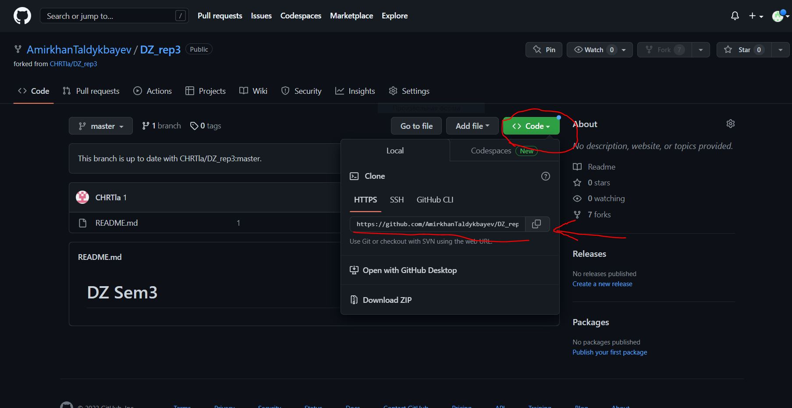

# DZ Sem3

## Чтобы отправить (pull request) внесённые изменения в файле README нужно сделать следующие шаги:
1. Сделать копию репозитория источника и добавить в свою библиотеку репозиториев, или как говорят форкнуть (fork);
2. После того как в нашей библиотеке репозиториев появилось копия репозитория нужно скопировать её ссылку в наш VScode
     ;
3. После того как ссылка скопирована, нужно создать папку на компьютере для работы в нашем локальном репозитории, куда мы будем мы будем выкачивать удаленный репозиторий;
4. Зайдя в VScode, открыть папку нашего локального репозитория и в терминале прописать **git clone (скопированная ссылка из второго шага)**;
5. Теперь в нашей папке появился удаленный репозиторий, готовый к работе локально. Чтобы перейти в него нужно использовать команду **cd name** (cd - change directory, name - имя папки);
6. Создаем ветку, в которой будем вносить изменения, при помощи команды **git branch branch_name** и переходим в неё при помощи **git checkout branch_name**;
7. После внесения изменений нужно их сохранить командой **Ctrl + S**, затем в терминале добавить в файл командой **git add file_name** или просто **git add .** и зафиксировать (закоммитить) новую точку сохранения наших изменений, прописав **git commit** или **git commit -m "Комменатарий к данному коммиту"**;
8. Теперь, когда наш файл готов к отправке на наш удаленный репозиторий, используем в терминале команду **git push** для отправки. Может выдать ошибку и в терминале выйдет подсказка для правильной отправки. В моём случае программа посоветовала мне использовать команду **git push --set-upstream origin branch_name**;
9. Заходим на наш аккаунт на GitHub, выбираем в нашем "форкнутом" репозитории нашу ветку и отправляем на проверку нажав на **Compare & pull request**.